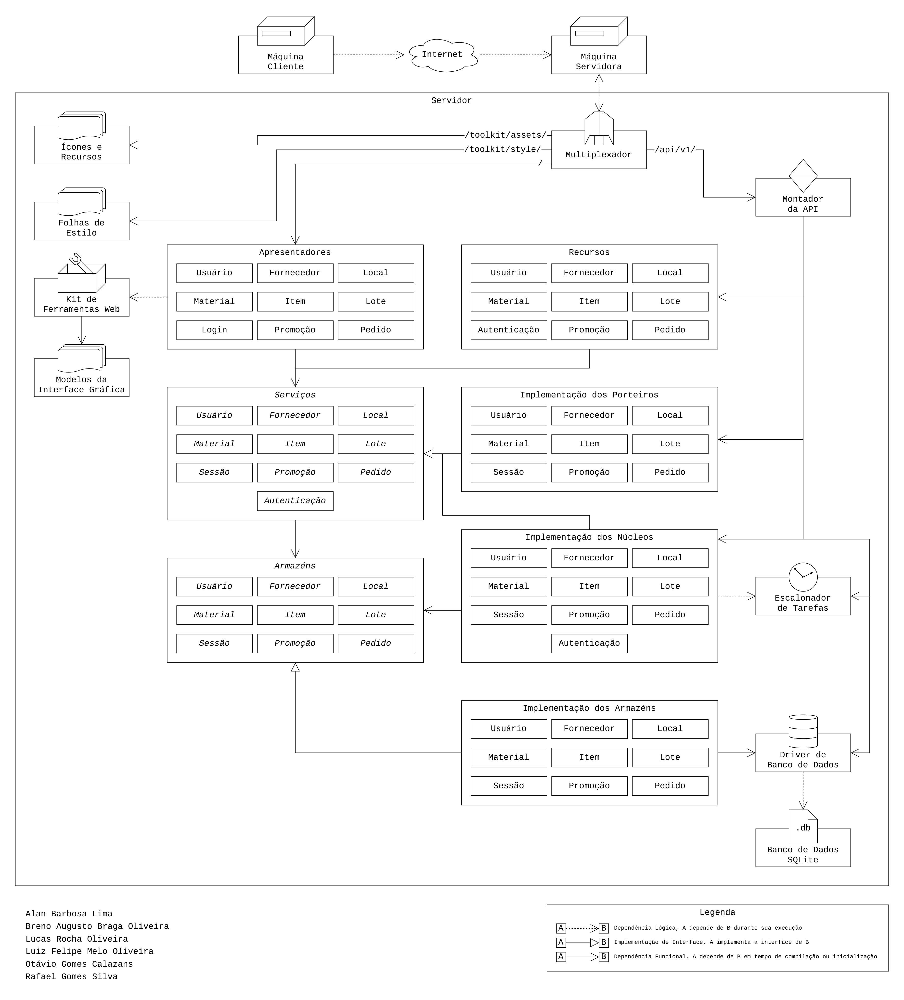
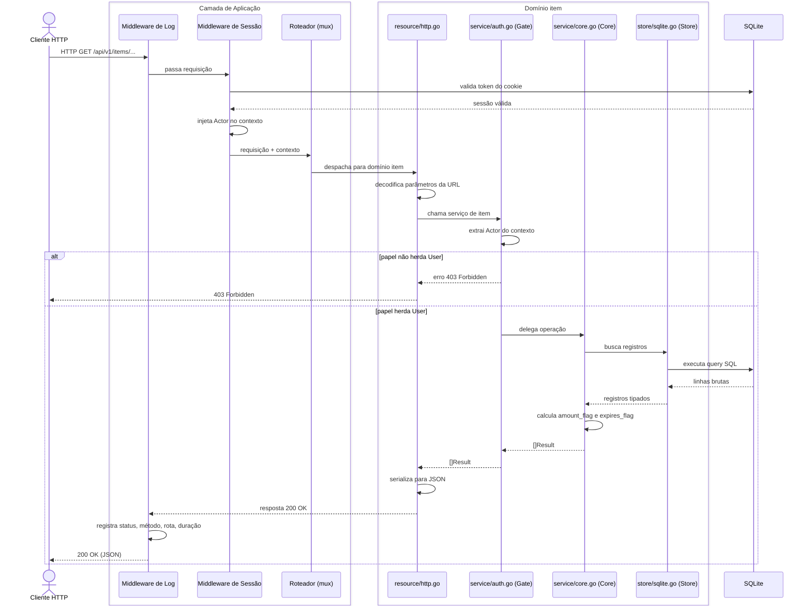

# Relatório descritivo do projeto Almodon

## Os autores 
- Alan Barbosa, 
- Breno Augusto Braga, 
- Lucas Rocha, 
- Luiz Felipe Melo, 
- Otávio Gomes e 
- Rafael Gomes. 

## 1. A introdução ao projeto
O projeto Almodon é um sistema gestor de estoque desenhado para o almoxarifado do curso de Odontologia da UFVJM. 

Justifica-se porque o departamento associado ao referido curso enfrenta entraves no controle do estoque de materiais odontológicos. Atualmente, todos os registros são feitos através de inserções manuais de entradas a tabelas semi-estruturadas, de modo que não há, dentre outras coisas, a padronização das informações, o controle de acesso dos usuários aos dados, uma funcionalidade de auditoria de transações ou a busca estruturada de itens. Quer dizer, apesar de responder ao problema de controle, a consistência e a eficiência da atual solução são baixas. Assim, acaba por minar o planejamento e a organização de aulas, pesquisas e atendimentos clínicos, além de dificultar todo o procedimento burocrático por trás da aquisição e/ou do consumo dos materiais odontológicos.

O Almodon seria, desse modo, uma alternativa que respondesse às deficiências de sua antecessora, de modo a permitir maiores consistência de transações, eficiência operacional, controle em tempo real e suporte à tomada de decisões. Mais especificamente, propõe-se a:

- prover a gestão automatizada dos pertences do estoque, como a sua definição, organização e as suas entradas e as saídas;
- registrar o histórico das movimentações para fins de auditoria;
- entregar as informações de forma clara e estruturada aos usuários tomadores de decisões;
- regular o acesso dos utilizadores do sistema, de acordo com as responsabilidades e permissões de que disporem.

## 2. A arquitetura e organização do software
O Almodon é organizado a partir duma arquitetura em camadas orientada a domínios, o que se justifica por prover um maior agnosticismo de um módulo do sistema com relação ao outro e, assim, proporcionar baixo acoplamento e alta modularidade. Ao mesmo tempo, o sistema possui um caráter autocontido, ao que não depende de _frameworks_ externos, mas embute o servidor, o sistema de banco de dados e a interface visual dentro de si. A sua filosofia é, então, "Se a plataforma possui um compilador de Go (e de C), ela é capaz de sustentar o sistema." Dessa maneira, não fica à mercê de dependências externas e se torna uma aplicação bastante portável.

As tecnologias escolhidas para a implementação do Almodon, naturalmente, correspondem à filosofia adotada: empregou-se o SGBD embutível SQLite3 e, para a apresentação/_fontend_, apenas HTML e CSS manipulados dinamicamente dentro da própria Go:

| Categoria | Tecnologia | Versão / Observação |
|---|---|---|
| Linguagem | Go | 1.26 |
| Banco de dados | SQLite3 | via `mattn/go-sqlite3` (driver CGo) |
| Criptografia | bcrypt | `golang.org/x/crypto` |
| Frontend | HTML + CSS puro | embutido via `go:embed` |

_Tabela 1: As tecnologias empregadas_

Em se tratando da estruturação do sistema, em si, há, na camada de domínio, os seguintes componentes principais (os secundários são mostrados na Imagem 1): `user`, `item`, `material`, `promotion` e `session`.

Cada um dos componentes é, na camada de domínio, `internal/domain`, estruturado da mesma forma. Há um `entity.go`, associado aos tipos e à validação de dados, um `service/core.go`, que lida com a lógica de negócio em si, um `service/auth.go`, que embrulha a lógica de neǵocio e a associa ao controle de acesso baseado em papéis, um `resource/http.go`, que trata de tornar uma requisição HTTP num serviço do sistem e, por fim, um `store/sqlite.go`, encarregado do repositório/persistência dos dados.

`domain.go` encarregada-se de montar e compor cada um dos artefatos acima mencionados.

Os usuários do sistema são indentificados por meio do SIAPE (matrícula de servidor federal), sendo que carregam consigo, também, as informações do seu nome, e-mail, senha e um _papel_. O papel determina o nível de acesso daquele utilizador às funcionalidades do sistema, sendo os possíveis valores, do menos ao mais abrangente: desautenticado (_Unlogged_), usuário (_User_), técnico administrativo (_Admin_), técnico administrativo promovido (_Promoted Admin_) e chefe de departamento (_Chief_).

As pemissões podem ser enumeradas como se segue:

- **Materiais e itens (leitura)** (`List`, `Get`): qualquer usuário autenticado (`User` ou superior).
- **Materiais e itens (escrita)** (`Create`, `Patch`, `Delete`, `UpdateAmount`): `Admin` ou superior.
- **Histórico de item**: `Admin` ou superior.
- **Usuários — (leitura e escrita)** (`List`, `Get`, `Create`, `Patch`, `Delete`): `Chief` ou superior, exceto que qualquer usuário autenticado pode consultar e editar seus próprios dados (`Me`, `Patch` e `Delete` sobre o próprio UUID).
- **Promoções**: `Chief` ou superior.

O subsistema de autenticação do Almodon baseia-se em _cookies_ de sessão. Ao se autenticar, com SIAPE e senha, o usuário recebe uma sessão com dois temporizadores diferentes, o primeiro, `idle_timeout`, de inatividade, o segundo, `hard_timeout`, absoluto. 
Têm valores-limite de 30 minutos e 24 horas, respectivamente.

Como anteriormente mencionado, há, no sistema, o conceito de uma promoção. Esta funcionalidade atende a uma necessidade das regras de negócio que prevê que usuários posicionados baixo na hierarquia de papéis possam tê-los (os seus papéis) temporariamente elevados (com um tempo máximo de 72 horas), por exemplo, para atender a períodos atípicos em que a demanda de gestores é maior.

Os materiais são uma definição abstrata de um pertence odontológico do almoxarifado. Carregam consigo um nome, uma descrição, uma unidade de medida, uma quantidade mínima em estoque e três códigos de indentificação/classificação, o código do e-campus, o CATMAT (catálogo de materiais do governo federal) e o SIADS. Estas informações são utilizadas nos processos de aquisição e prestação de contas aos órgãos competentes.

Os itens, por sua vez, são as instâncias concretas de materiais. Dessa maneira, também mantém informações de estado, como a sua quantidade atual e a sua data de validade e são utilizados no controle operacional. Associados aos itens há, também, um histórico imutável de versões que registra as ações e consequentes mudanças sobre eles empregadas. 

_Imagem 1: O diagrama da arquitetura de software do Almodon_

O caminho feito por uma requisição pode ser visto na Imagem 2:

_Imagem 2: O diagrama de sequência de uma requisição do Almodon_

## 3. A gestão de configuração

A gestão de configuração do Almodon se deu através das ferramentas git, para o controle de versionamento e histórico de efetivações local e GitHub para a hospedagem remota, _pull requests_, controle de _issues_ e revisão de código. O subsistema GitHub Projects também foi utilizado por prover um quadro Kanban de gestão de tarefas.

Aos _commits_ foi aplicada a seguinte convenção: 

`<tipo> [ "(" <escopo> ")" ] [ "!" ] ": " <mensagem>`

Em que os tipos permitidos podem ser um dos valores a seguir:

- `feat`: para a adição de uma nova funcionalidade;
- `doc`: para a documentação de funcionalidades;
- `fix`: para a correção de bugs;
- `test`: para a adição ou modificação de testes;
- `refactor`: para mudanças no código que não adicionam funcionalidades ou consertam bugs.
- `style`: para mudanças que não afetam o significado do código (espaços em branco, formatação, etc);
- `merge`: para _commits_ de _merge_.

O `<escopo>` refere-se ao pacote ou à unidade semântica afetada pelo _commit_.

O `!` opcional descreve `BREAKING CHANGE`, isto é, quando uma API pública é alterada.

A `<mensagem>`, por sua vez, é uma descrição curta que descreve as alterações efetivadas.

As _issues_ foram usadas como tarefas a guiar o desenvolvimento. Convencionou-se que o seu título começasse com um verbo no infinitivo, em português, e que fosse uma descrição curta da _issue_. A descrição destalha ao que a tarefa se propõe.

Uma vez publicada, a _issue_ vai para o `Backlog` do projeto, onde é possível associar uma data limite e, se for o caso, passá-las para o estado `Ready`. Os colaboradores interessados em concluí-la, então, passavam-na ao estado `In Progress`. Quando terminada, o seu estado se muda para `In Review`, indicando que está sujeita à revisão.

Há um ramo principal, `master`, sendo que, para que novas funcionalidades fossem trabalhadas de forma isolada, foram criados outros ao longo do desenvolvimento do projeto. Estes ramos efêmeros eram, subsequentemente, integrados através de _pull requests_. Similar às convenções já expostas, eram nomeadas na forma `<tipo> / <unidade>`.

O `<tipo>` é algum valor dentre os a seguir:

- `feat`: para a adição de uma nova funcionalidade;
- `doc`: para a documentação de funcionalidades;
- `fix`: para a correção de bugs;
- `test`: para a adição ou modificação de testes;
- `refactor`: para mudanças no código que não adicionam funcionalidades ou consertam bugs;
- `style`: para mudanças que não afetam o significado do código (espaços em branco, formatação, etc).

E a `<unidade>` é algo que descreve o que é feito.

Pull requests possuem um título e uma descrição. O título segue o mesmo formato dos títulos das _issues_.

A descrição contém uma explicação detalhada das alterações feitas no _pull request_, incluindo o motivo dessas alterações e quaisquer informações relevantes para a revisão do código.

Caso o pull request esteja associado a uma _issue_, deve-se referenciar a issue na descrição, caso ele feche alguma issue, deve-se usar a sintaxe `resolve #<número da issue>`, pois "resolve" é a palavra reservada para fechar issues automaticamente no GitHub, e essa é a que mais se aproxima do português com um sentido natural.

## 4. Os testes

Os testes aplicados foram os testes unitários e os testes de integração. Para que fossem implementados, não se utilizou ferramentas externas, mas aquelas próprias da linguagem Go. Notadamente, `go test`, que executa, para um pacote, aqueles arquivos cujos nomes forem da forma `*_test.go` que contiverem, por sua vez, funções de assinatura `func TestSomething(t *testing.T)`. As informações acerca da cobertura de comandos dos testes, obtêm-se através da funcionalidade `go test -cover`. Além disso, há também outros testes igualmente relevantes, como os de condições de corrida (com `go test -race`).

Dentre os testes unitários realizados, cabe menção, por exemplo:

- `user/entity_test.go`: testa as funções de validação `ProcessEmail()` (11 casos, incluindo a limpeza de espaços, formatos inválidos, ausência de TLD) e `ProcessPassword()` (8 casos, incluindo limites de tamanho, espaço inicial/final, caracteres de controle, e _round-trip_ bcrypt);
- `session/entity_test.go`: teste de propriedade — verifica inversibilidade entre `Token.String()` e `ParseString()` com 1000 amostras aleatórias.

Já em relação aos testes de integração, destaca-se:

- `auth/resource/http_test.go`: login com credenciais corretas (verifica presença de cookie de sessão), login com senha inválida (verifica status 4xx), logout com ciclo completo (login → logout → verificação);
- `user/resource/http_test.go`: criação de usuário, busca por SIAPE, busca por UUID, edição parcial com `PATCH` (com confirmação via nova leitura), exclusão (com confirmação via GET que deve retornar 4xx), tentativa de criação sem sessão;
- `promotion/resource/http_test.go`: criação de promoção, leitura com validação de campos (`UUID`, `User`, `Expires`), atualização de `max_age`, exclusão com confirmação, tentativa sem sessão.

Os testes foram imprecisndíveis para que algumas falhas fossem identificadas e, subsequentemente, corrigidas. Por exemplo:

| Commit | Correção motivada por teste |
|---|---|
| `fix(uuid): fix variant bit order` | Erro de ordenação de bits detectado pelo teste de invariante UUIDv7 |
| `fix(session): fix stack overflow, byte overflow` | Identificado durante implementação do token criptográfico |
| `fix(session/token): fix pool copy` | Bug de cópia de slice no pool de bytes do token |
| `fix(uuid): fix buffer overflow bug` | Detectado durante refatoração com suporte a testes |
| `fix(session): fix race condition` | Race condition em sessões (detectável com `go test -race`) |
| `fix(material): correct mutex lock order` | Deadlock potencial corrigido após análise |
| `test(auth): introduce dynamic port assignment` | Correção de conflito de porta nos testes paralelos |

_Tabela 2: A relação de commits e correções de falhas_

## 5. Os aspectos de qualidade

Em relação aos atributos clássicos de qualidade de software, especialmente a manutenibilidade, a confiabilidade, a segurança e a portabilidade, todos eles foram, nalguma medida, considerados ao decorrer dos trabalhos de desenho ou implementação. A manutenibilidade é favorecida, como já reiterado, por uma arquitetura modular além de que houve convenções de código bem definidas e documentadas e histórico de _commits_ organizado e semanticamente consistente. Quer dizer, o código adota convenções de nomenclatura, formatação automática (com `go fmt`) e incentivo a _commits_ atômicos, enquanto a organização em subdomínios com estruturas padronizadas facilita a localização e compreensão das funcionalidades por novos desenvolvedores. A existência de uma grande refatoração estrutural ao longo do desenvolvimento, realizada de forma controlada por meio de múltiplos commits de refatoração, também evidencia a capacidade de evolução do sistema.

A confiabilidade é reforçada pelo uso de transações explícitas no SQLite, pelo histórico imutável de versões dos itens armazenados e por mecanismos de gerenciamento de sessões e promoções baseados em agendamento de tarefas, o que garante o seu correto funcionamento mesmo após a reinicializações da aplicação. O projeto também implementa o desligamento _gracioso_ do servidor, além de que há especial atenção a problemas de programação concorrente (devido à natureza da aplicação);

No aspecto de segurança, o sistema utiliza _hash bcrypt_ para o armazenamento de senhas, há tokens de sessão gerados com entropia criptográfica por meio de crypto/rand, além do controle de acesso baseado em papéis (RBAC) com herança de permissões. Destaca-se, ainda, a adoção de dois mecanismos independentes de expiração de sessão: um limite por inatividade e outro absoluto.

A portabilidade é favorecida pela distribuição da aplicação como um único executável, com a interface web incorporada ao binário por meio de go:embed, eliminando dependências externas de arquivos estáticos e reduzindo problemas de implantação. Embora o driver SQLite exija suporte ao CGo durante a compilação, o processo de instalação é automatizado por scripts próprios.

Para o suporte à qualidade, o projeto utiliza ferramentas nativas do ecossistema Go, como já fora mencionado: `go fmt` para formatação, `go test` para execução de testes, `go test -race` para detecção de problemas de concorrência e `go vet` para a análise estática.

## 6. A participação dos integrantes

Dentre os membros o Alan foi o líder técnico, o responsável pelo desenho da arquitetura do projeto, sendo ativo em todas as frontes de desenvolvimento e subsistemas. Também revisou e integrou todos os _pull requests_ de outros membros. O Breno contribuiu para o desenho e implementação de funcionalidades ao ciclo de materiais e itens. O Otávio e o Luiz, por sua vez, trabalharam na implementação do subsistema de sessões. O Lucas contribuiu para a confecção das tabelas do banco de dados, bem como para a integração deste ao restante do sistema. Por fim, o Rafael se debruçou sobre a identidade visual do Almodon, sendo o responsável pelo seu mascote e demais ilustrações.

## 7. O aprendizado e as perspectivas futuras

Ao longo do desenvolvimento do projeto, foram adquiridos conhecimentos importantes relacionados ao planejamento e à construção de software, especialmente no que diz respeito à definição de arquitetura, à aplicação de princípios de qualidade e à organização de um código que possa evoluir ao longo do tempo. A experiência demonstrou que decisões arquiteturais tomadas no início do projeto exercem grande influência sobre a facilidade de manutenção, expansão e correção do sistema.

Dentre as dificuldades encontradas, destaca-se o desafio de projetar abstrações adequadas, sendo que encontrar o equilíbrio entre simplicidade, reutilização e flexibilidade exigiu grande esforço congnitivo, além de revisões e refatorações.

Como reflexão geral, o desenvolvimento evidenciou que a construção de software é um processo iterativo, no qual decisões precisam ser constantemente reavaliadas à medida que novos requisitos surgem e o entendimento do domínio evolui. Refatorações, revisões arquiteturais e ajustes de processos mostraram-se atividades naturais e necessárias para manter a qualidade do sistema ao longo do tempo.

Do ponto de vista pessoal e profissional, a experiência fortaleceu competências relacionadas à engenharia de software, ao projeto de arquiteturas escaláveis e à gestão da qualidade de código. A experiência também reforçou a importância de estabelecer padrões claros desde o início do desenvolvimento, especialmente neste caso, em que se trata de um projeto colaborativo, onde a manutenção da consistência e da qualidade tende a se tornar um desafio cada vez maior à medida que o sistema cresce.
